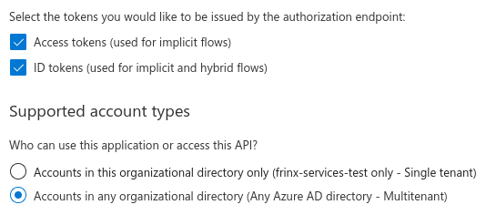
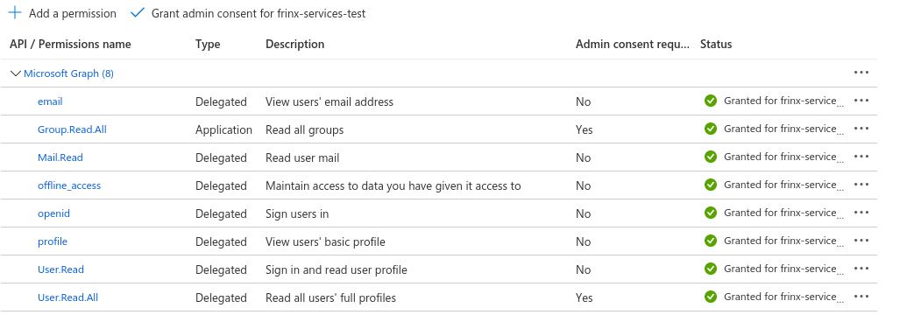
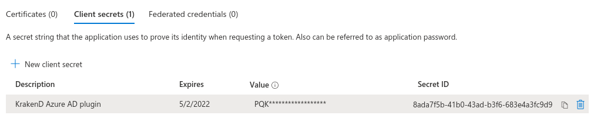
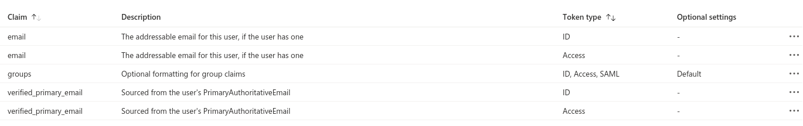

# Frinx Machine with Azure AD 

Frinx Machine supports authentification and authorization via Azure AD. The following sections describe how to set up Azure AD for Frinx Machine.
## Client configuration
Register the application in your Azure AD and configure the following settings.

<br>

### Redirect URIs

Set platform redirect URIs on the Authentication page. The table below shows examples of configuration settings.

| Syntax                | Platform configuration  | Redirect URI                                    |
| :---                  |    :----:               |          :---                                   |
| Frontend Login        | Single-page application | https://<**IP/DNS**>/ ,e.g. https://localhost/  |
| Uniflow docs (swager) | Web                     | https://<**IP/DNS**>/oauth2-redirect.html       |
| Cloud swagger         | Web                     | https://editor.swagger.io/oauth2-redirect.html  |
| Local Postman         | Web                     | https://oauth.pstmn.io/v1/callback              |
| Cloud Postman         | Web                     | https://getpostman.com/oauth2/callback          |

**Frontent login URI** is passed to the installation script `azure_ad.sh` via `--redirect_url` flag.

<br>

### Implicit flow and single/multi tenancy settings
On the same page choose single/multi tenancy. 
Based on this setting, the parameter `--tenant_name` is defined in the installation script `azure_ad.sh`.

For a single-tenant, use Azure AD domain name from AD overview. For multi-tenant use value `common`. 

Enabled implicit flow is optional based on specific requirements.



<br>

### API permissions



<br>

### Client secrets

Generate secret and use it as an input parameter for `--client_secret` flag in the installation script `azure_ad.sh`. 

This secret is used in KrakenD azure plugin for translating group id to the group name (human-readable format).




### Token claims configuration



Example of encoded JWT token with claims. These claims are transferred to the request header (see [KrakenD Azure Plugin docs](https://github.com/FRINXio/krakend-azure-plugin) for more info).

``` json
{
  ......
  "tid": "aaaaaaaa-1234-5678-abcd-abcd12345678",
  "name": "Test User",
  "oid": "d040c2a8-aaaa-bbbb-cccc-f2900fea4f51",
  "preferred_username": "user@test.onmicrosoft.com",
  "roles": [
    "User.ReadWrite"
  ],
  "groups": [
    "bbbbbbbb-cccc-1234-5678-abcd12345678"
  ],
  ......
}
```
<br>

## Docker secrets configuration

These settings should be generated by `azure_ad.sh` script. 
### frontend

Settings for Frontend authorization popup window

>   * AUTH_CLIENT_ID : App (Client) ID
>   * AUTH_REDIRECT_DOMAIN : IP/DNS of server without scheme (http(s)://) !!!
>   * MSAL_AUTHORITY : url for logging to Azure AD with tenant name

### inventory

Settings for devices owner installed in uniconfig-zones via inventory.

>   * X_TENANT_ID : tenant id where '-' are replaced with '_' 

# workflow-proxy

Settings for uniconfig/uniflow swagger docs.

>   * OAUTH2_AUTH_URL=https://login.microsoftonline.com/common/oauth2/v2.0/authorize
>   * OAUTH2_TOKEN_URL=/api/uniflow/docs/token

### KrakenD AZURE AD PLUGIN SETTINGS

Settings for azure-ad plugin and jwt validation

>   * AZURE_LOGIN_URL : url for logging to Azure AD, default: https://login.microsoftonline.com
>   * AZURE_TENANT_NAME : tenant domain name
>   * AZURE_TENANT_ID : tenant id where '-' are replaced with '_'
>   * AZURE_KRAKEND_PLUGIN_CLIENT_ID : App (Client) ID
>   * AZURE_KRAKEND_PLUGIN_CLIENT_SECRET : App (Client) secret
>   * AZURE_KRAKEND_PLUGIN_JWT_VALUE_PREFIX=Bearer
>   * AZURE_KRAKEND_PLUGIN_GROUP_DISABLE=false

## RBAC configuration

All default settings are defined in **config/secrets/frinx_rbac** and are stored to docker secrets during execution of ./install.sh

### Uniflow

RBAC proxy adds 2 features on top of tenant proxy:
* Ensures user authorization to access certain endpoints
* Filters workflow definitions and workflow executions based on user's roles, groups and userID

RBAC support simply distinguishes 2 user types: an admin and everyone else.
An admin has full access to workflow API while ordinary user can only:
* Read workflow definitions
  * Ordinary user can only view workflow definitions belonging to the same groups
  * A workflow definition (created by an admin) can have multiple labels assigned
  * A user can belong to multiple groups 
    * User groups are identified in HTTP request's header field `x-auth-user-roles`
  * If an ordinary user's group matches one of workflow labels, the workflow becomes visible to the user
* Execute visible workflow definitions 
* Monitor running executions
  * Only those executed by the user currently logged in

Define user roles in workflow by adding role or group name to description label.

Example: added User.ReadWrite, Role.ReadWrite, Group.ReadWrite labels to workflow description.

``` json
{
  "name": "Install_all_from_inventory",
  "description": "{\"description\": \"Install all devices from device inventory\", \"labels\": [\"User.ReadWrite\", \"Role.ReadWrite\", \"Group.ReadWrite\"]}",
  "version": 1,
  "tasks": [
  ......
```

### Uniconfig

Super-users (based on their role and user groups) can use all REST APIs. 
Regular users will only be able to use GET REST API requests.

|                    | READ (GET REQUEST)   | WRITE (ALL REQUEST)  |
| :---               |    :----:            |  :---:               |
|Admin (Super user)  | true                 | true                 |
|Regular user        | true                 | false                |

### Uniresource

A simple RBAC model is implemented where only super-users (based on their role and user groups) can manipulate resource types, resource pools and labels. Regular users will only be able to read the above entities, allocate and free resources.

|                    | READ          | WRITE  |
| :---               |    :----:     |  :---: |
|Admin (Super user)  | true          | true   |
|Regular user        | true          | false  |
